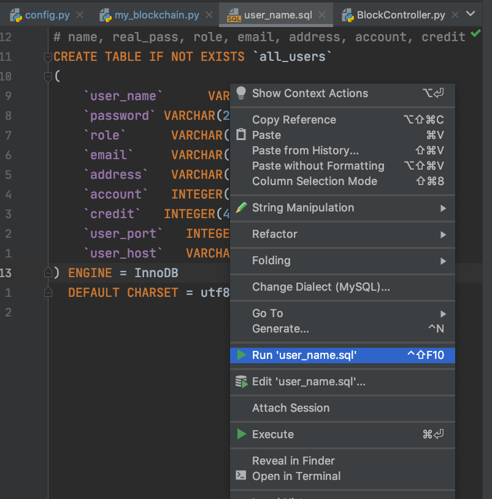
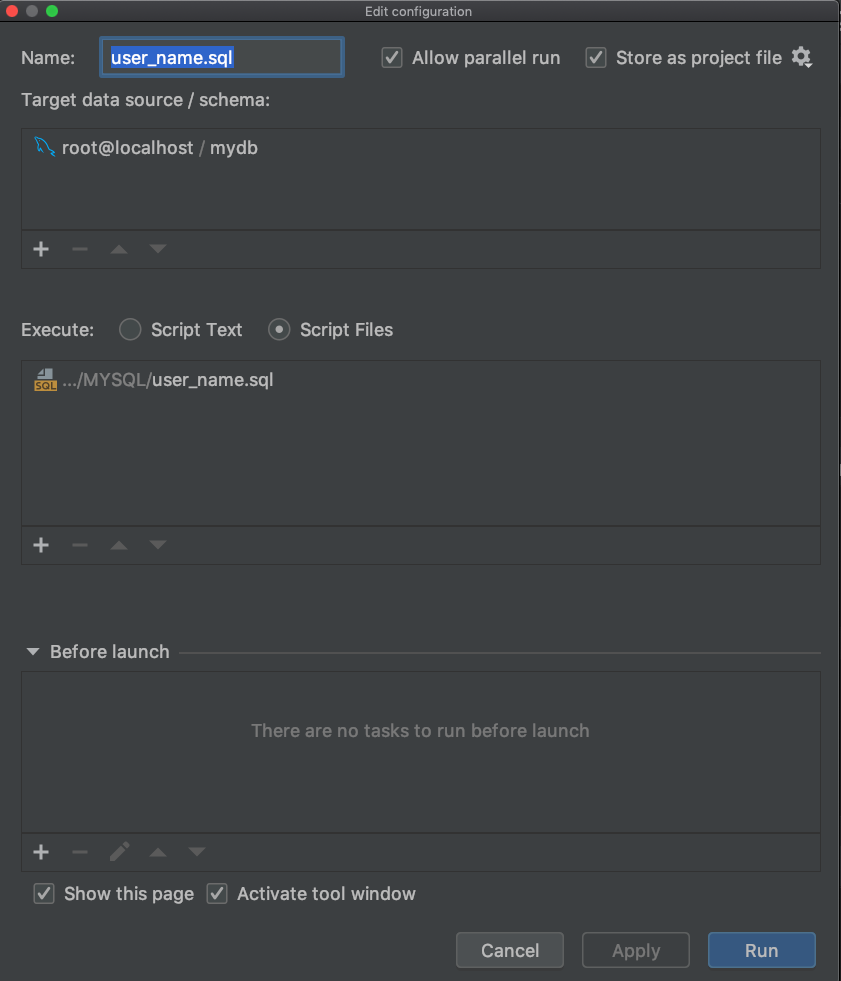
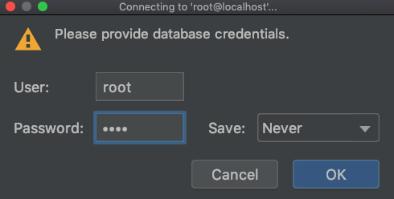
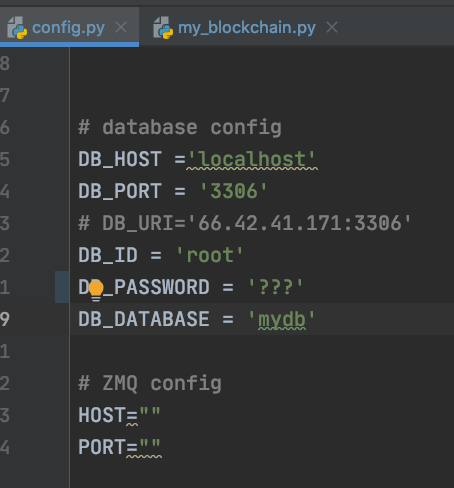
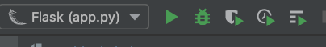
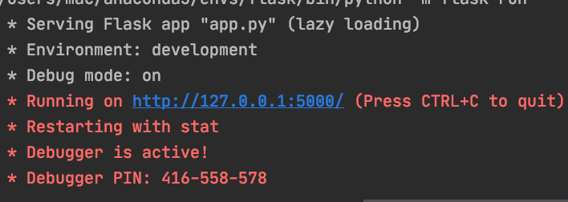
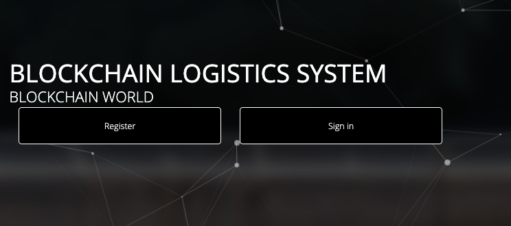
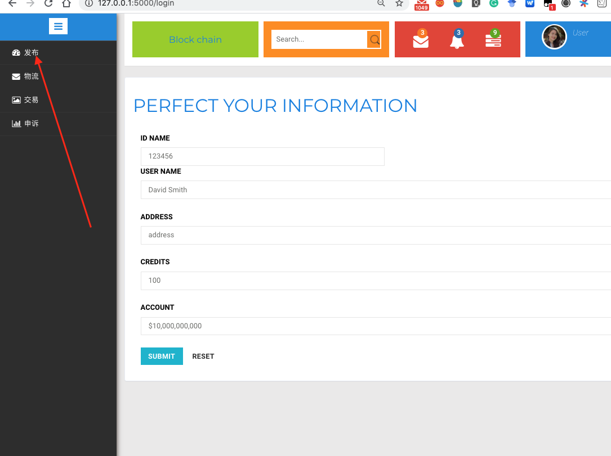
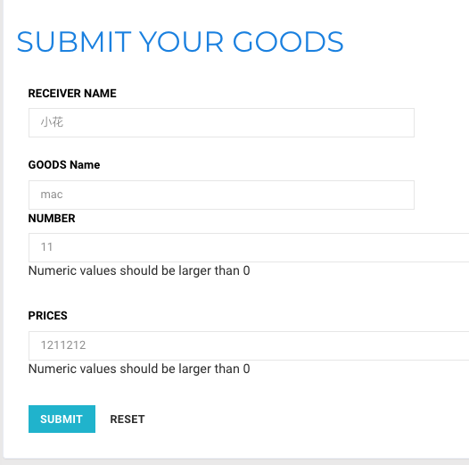
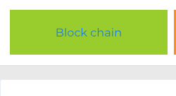

# 区块链物流

环境配置

```bash
conda create -n blockchain_flask python=3.6
conda activate blockchain_flask
pip install -r requirements.txt
```


## 运行
-  pycharm配置

用pycharm打开my_blockchain，进行下列配置，注：可能pycharm专业版才有此功能


如果没有mysql，要在自己电脑先把mysql数据库装好

- 创建一个`mydb`的数据库
- 建表

运行这个文件就可以了









- 代码配置

把数据库密码填上



点击运行按钮



结果



点开网址,先注册



接着登录




发布商品



区块链查看

