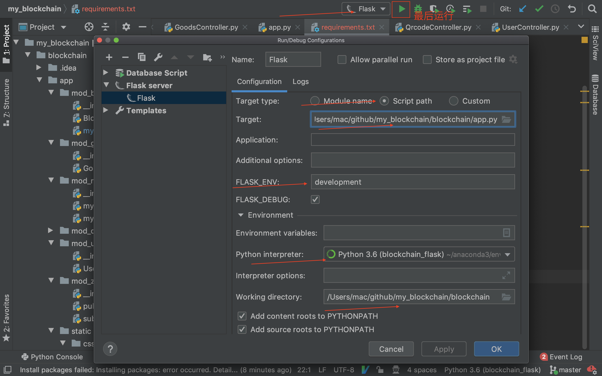

# my_blockchain

环境配置

```bash
conda create -n blockchain_flask python=3.6
conda activate blockchain_flask
pip install -r requirements.txt
```


## 运行方法1

用pycharm打开my_blockchain，进行下列配置，注：可能pycharm专业版才有此功能




## 运行方法2
还没完成,代码引用需要调整
```
export FLASK_APP=app.py
flask run
```

